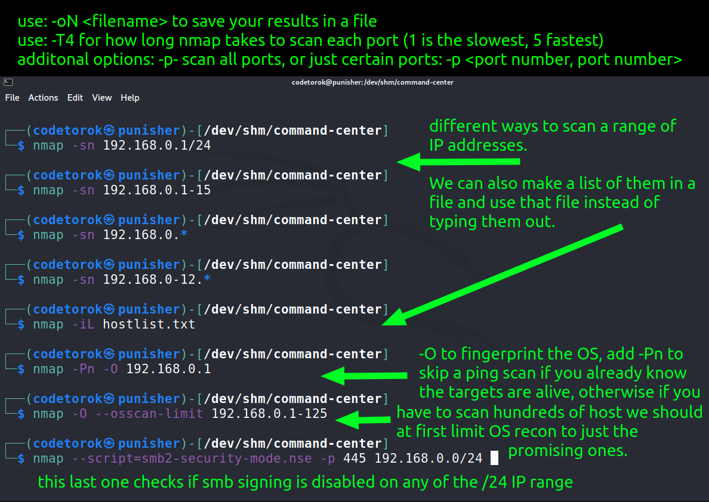

<h1 align="center">Welcome to the Command-Center!</h1>

<h2 align="center">There are so many tools, commands and switches... it's easy to forget them! I made this repo so you can quickly search for the right ones when needed.</h2>

<h3 align="center">Let's exit the outside world and enter cyber space. (We have cookies... 😎)</h3>

The way it works is that you use your browser's search function to quickly find commands for a tool you need. In Firefox for example this is done by using <code>CTRL+F</code>

Let's try it! Let's use the search phrase "hydra". Hit <code>CTRL+F</code> and then type in the search bar <code>hydra</code> you'll see that the first result will be this very line because that's the first occurence for that word but if you use your up and down arrows next to the search bar you can quickly jump to the next occurence where you'll find the most commonly used switches and a little explanation about the program.

Alternatively you can just browse through these commands using your slider in your browser or your mouse wheel in the middle. Anyways, I hope this repo can serve you well, let me know if you have any comments or suggestions, you can reach me here or on LinkedIn or Twitter @codetorok thanks for checking out the Command-Center!

commands and text here

commands and text here

commands and text here

commands and text here

commands and text here

commands and text here

commands and text here

commands and text here

commands and text here

commands and text here

commands and text here

commands and text here

commands and text here

commands and text here

commands and text here

commands and text here

commands and text here

commands and text here

commands and text here

commands and text here

commands and text here

commands and text here

commands and text here

commands and text here

commands and text here

commands and text here

commands and text here

commands and text here

commands and text here

commands and text here

commands and text here

commands and text here

commands and text here

commands and text here

commands and text here

commands and text here

commands and text here

This is the end of the list, remember, it's not the commands, it's what you do with those commands and how do you use the information you get out of theses swites, that's all that matters. This repo is for educational purposes only, anything you do with this is on you, so be responsable.

<h2 align="center">The world is at your fingertips 💯</h2>

**Github, Twitter, LinkedIn:** @codetorok
