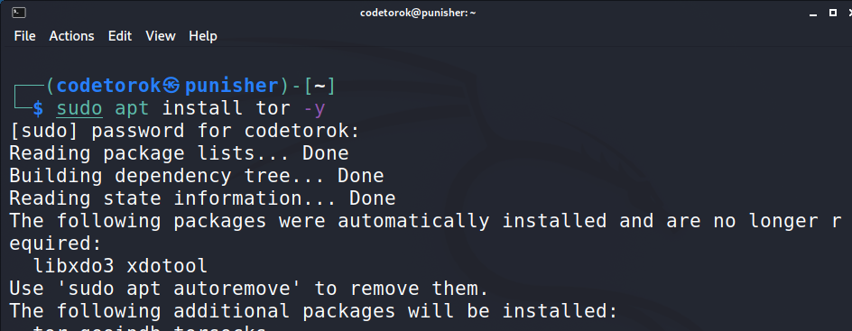
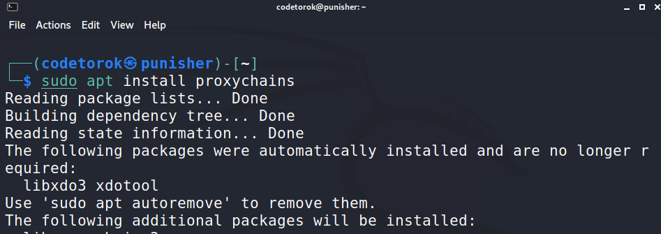
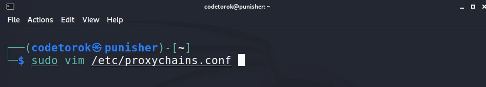
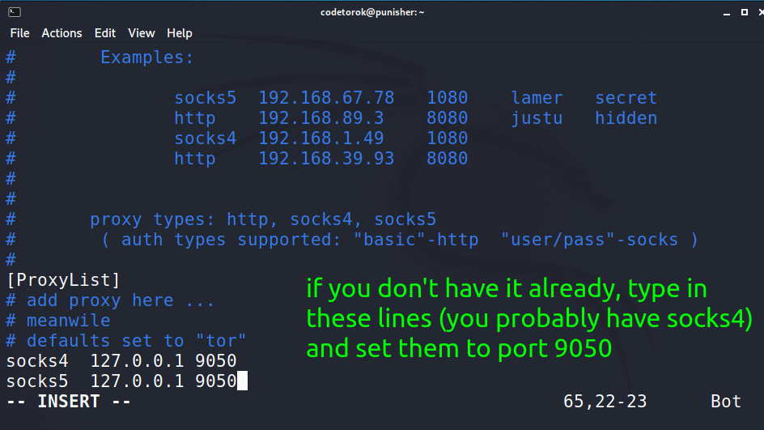

# How to stay anonymous - TOR SERVICE

## Before you read on I would like to make two things clear:

* All credit goes to **HackerSploit** for this one as I learned everything from his [video](https://youtu.be/NN9fQwiomAU) tutorial. Respect.

* Second: this information is for eductational purposes, all actions you take with it is on you! In other words,
please don't be stupid :)

**[Back to Command-Center](https://github.com/codetorok/command-center/blob/master/README.md)**

* ⚠️ in addition to the below steps make sure you uncomment the **_proxy_dns_** in your **_proxychains.conf_** file. 
* With that said, let's dive into it. There is no explication needed for this one, just follow the steps provided below, it's easy!

