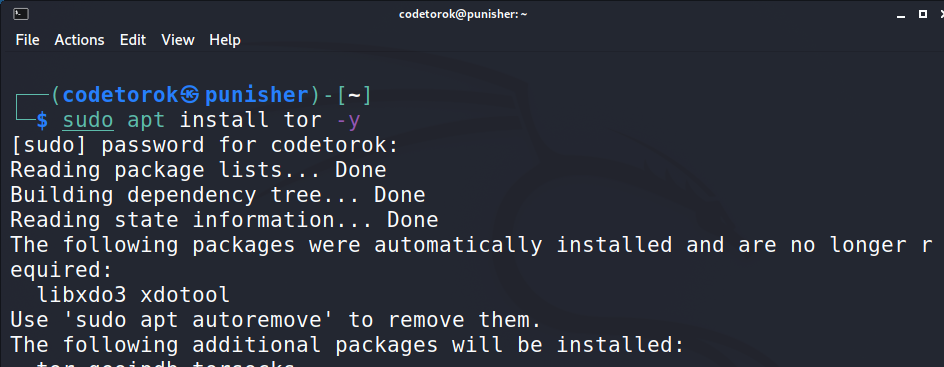
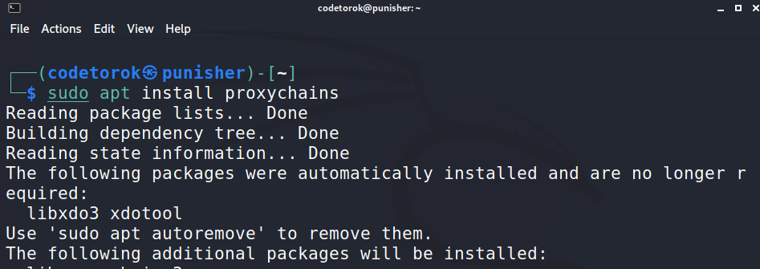
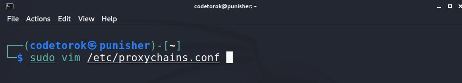
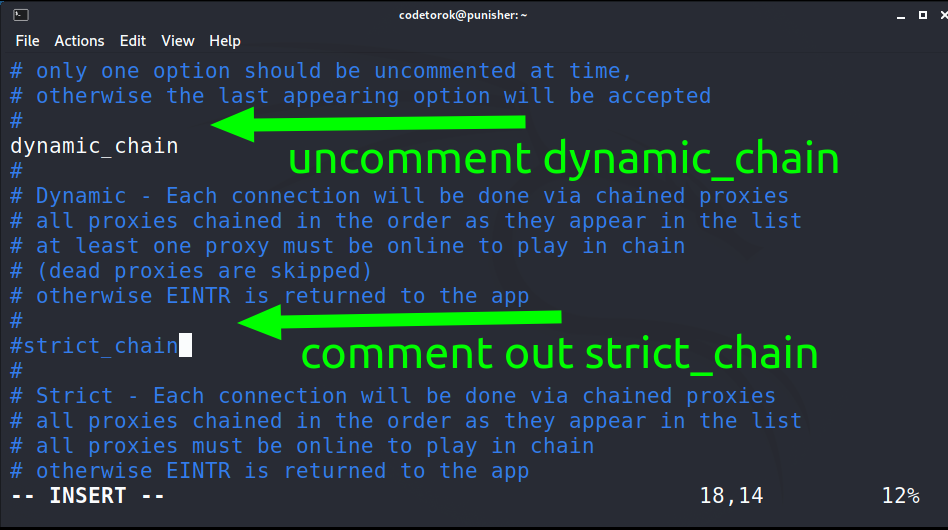
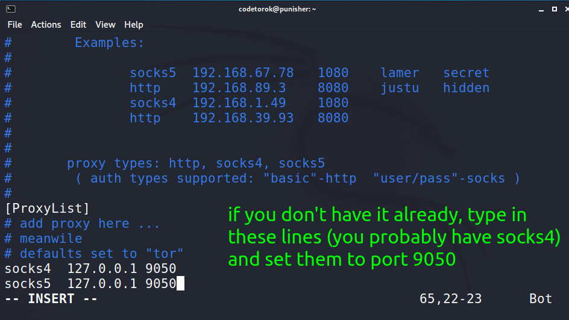
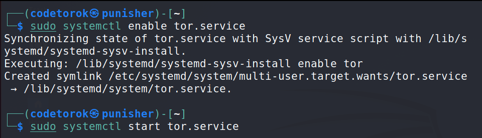
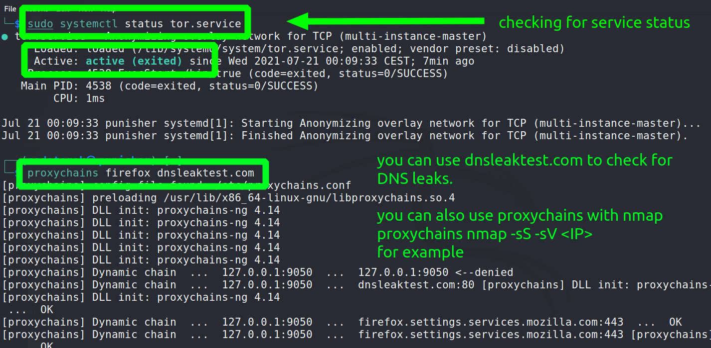
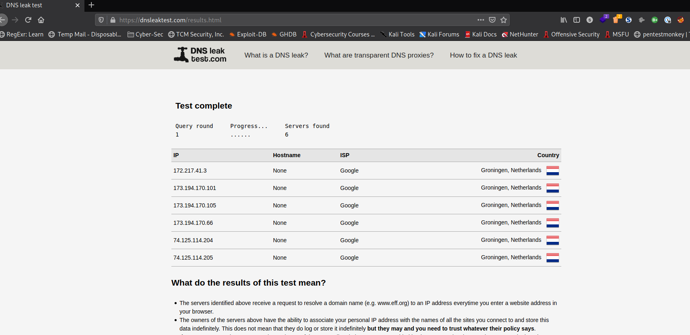

# Tor Service / Anonymity

## [Back To Command-Center](https://github.com/encryptedninja/command-center/blob/dev/README.md)

## Before you read on I would like to make two things clear:

- All credit goes to **HackerSploit** for this one as I learned everything from his [video](https://youtu.be/NN9fQwiomAU) tutorial. Respect.
- Second: this information is for eductational purposes, all actions you take with it is on you! In other words, please don't be stupid :)

⚠️ in addition to the below steps make sure you uncomment the ***proxy_dns*** in your ***proxychains.conf*** file.

- With that said, let's dive into it. There is no explication needed for this one, just follow the steps provided below, it's easy!

